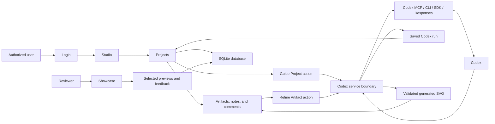

# ADR 0001: Creative IP Studio Architecture

## Status

Accepted. Codex runtime details were amended by [ADR 0003](0003-codex-mcp-refinement-workflow.md).

## Context

The app is a creative product studio for early creative ideas. Users can create projects, add source material, and use Codex to help move an idea toward a working artifact.

The first example is a typeface project based on photos and notes about a physical object. The app should also support other product ideas later.

The first version should include:

- login / authorization
- data persistence
- meaningful tests
- programmatic use of Codex inside the app or workflow

## Decision

Build the first version as a web app with server-side persistence and a controlled Codex service boundary.

Use:

- SQLite for local persistence
- session-based login
- project-level authorization
- Codex MCP / CLI / SDK / Responses fallback paths for programmatic Codex calls
- structured Codex outputs saved as project history
- validated generated SVG artifacts for asset refinement
- a showcase surface for selected preview or release material
- a studio surface for authorized project work

Codex is used first as a project guide. The project-level action is `Guide Project`, which takes saved project state and returns structured guidance, questions, next actions, and a high-level route toward a working artifact.

Codex is also used as an asset refiner. The asset-level action is `Refine Artifact`, which takes a selected asset and comments, then returns structured critique plus a generated SVG revision.

## Rationale

SQLite is enough for the first version and keeps the project easy to run locally.

Session login and project collaborators directly support the idea that early creative work is protected IP until the studio chooses to preview, review, or release it.

A controlled Codex service boundary lets the app decide when Codex is called, what context is sent, how the response is validated, and how the result is stored.

Structured Codex output gives the app a reliable contract. The app can render and persist guidance without treating arbitrary generated text or code as trusted execution.

## Security Position

The app does not execute generated code directly during a user session.

Codex can return generated SVG content for asset refinement. The server stores it only after validation. The current validator rejects scripts, event handlers, `foreignObject`, JavaScript URLs, and remote asset references. Stronger parser-based SVG validation remains future work.

The app executes its own built-in actions against validated data. This keeps Codex inside a controlled workflow.

## Consequences

The first version focuses on the product lab workflow rather than complete font generation.

The app should support shelved projects. Not every idea needs to become a finished product.

The typeface workflow can grow in layers:

- project guidance
- source material collection
- glyph planning
- SVG draft generation
- asset comments and revision history
- fast test output, such as a web font preview or installable font file
- font build tooling
- specimen preview
- publishing and feedback

## Architecture Diagram

