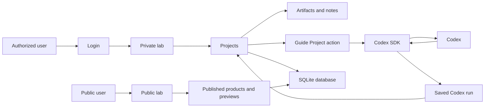

# ADR 0001: Creative IP Lab Architecture

## Status

Accepted

## Context

The app is a private product lab for early creative ideas. Users can create projects, add source material, and use Codex to help move an idea toward a working artifact.

The first example is a typeface project based on photos and notes about a physical object. The app should also support other product ideas later.

The first version should include:

- login / authorization
- data persistence
- meaningful tests
- programmatic use of Codex inside the app or workflow

## Decision

Build the first version as a web app with server-side persistence and Codex SDK integration.

Use:

- SQLite for local persistence
- session-based login
- project-level authorization
- Codex SDK for programmatic Codex calls
- structured Codex outputs saved as project history
- a public lab surface for published or preview material
- a private lab surface for authorized project work

Codex will be used as a project guide first. The initial app action is `Guide Project`, which takes the saved project state and returns structured guidance, questions, next actions, and a high-level route toward a working artifact.

## Rationale

SQLite is enough for the first version and keeps the project easy to run locally.

Session login and project collaborators directly support the idea that early creative work is private IP until the lab chooses to publish or preview it.

The Codex SDK is a direct way to show programmatic Codex usage from inside the app. The app controls when Codex is called, what context is sent, how the response is validated, and how the result is stored.

Structured Codex output gives the app a reliable contract. The app can render and persist guidance without treating arbitrary generated text or code as trusted execution.

## Security Position

The app will not execute generated code directly during a user session.

Codex may generate plans, structured data, SVG drafts, font build instructions, code patches, or other artifacts in later iterations. Those outputs must be stored, validated, previewed, and approved before they affect the product.

The app executes its own built-in actions against validated data. This keeps Codex inside a controlled workflow.

## Consequences

The first version will focus on the product lab workflow rather than complete font generation.

The app should support shelved projects. Not every idea needs to become a finished product.

The typeface workflow can grow in layers:

- project guidance
- source material collection
- glyph planning
- SVG draft generation
- fast test output, such as a web font preview or installable font file
- font build tooling
- specimen preview
- publishing and feedback

The architecture leaves room for MCP later, but the first implementation should use the Codex SDK to reduce moving parts.

## Architecture Diagram

